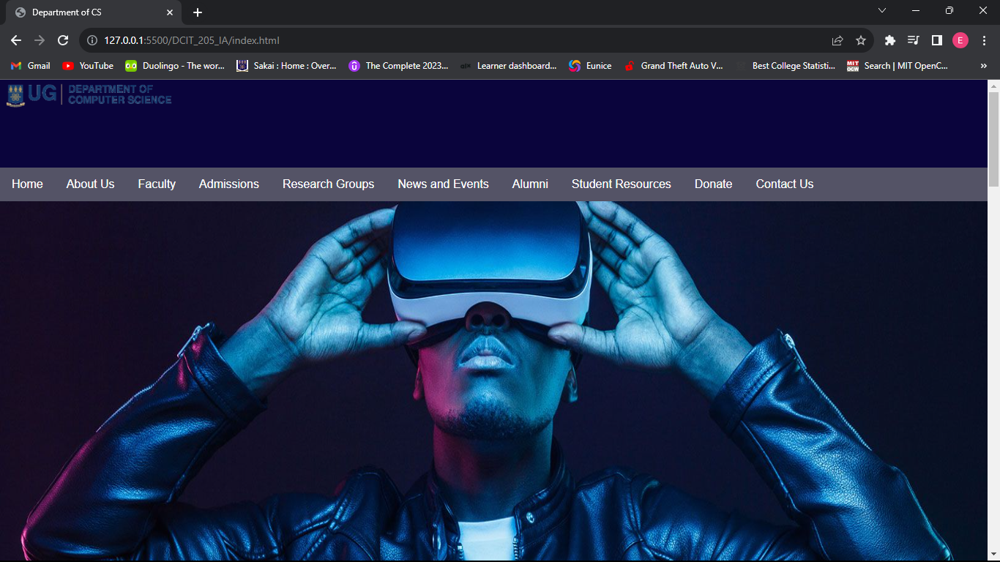

# DCIT_205_IA

Name: Eunice Yaa Akligo
Student Id: 11135195

Introduction: This is my redesigned version of the website for the Department of Computer Science. 

Purpose: It serves as an appropriate channel for the dispensation of information pertaining to said department, such as current, news, student resources and notable alumni.

Set-up: 1. Ensure that Git is installed on your device. You can download it from https://git-scm.com/.
2. Open a terminal or command prompt on your local machine.
3. Change the directory to the one where you want to clone the repository. ie. cd [directory]
4. Copy the repository URL from github, then run this command - git clone [repository URL]
5. Change the directory into the project directory using cd [Project directory]
6. Now, when the "ls" command is entered in your terminal, the files will all show up and can be run for full benefit.

Now, let's take a walk through the website.

# Home Page

I learnt how to create headers and navigation bars for webpages. I also ensured that they were responsive on smaller screen sizes.

